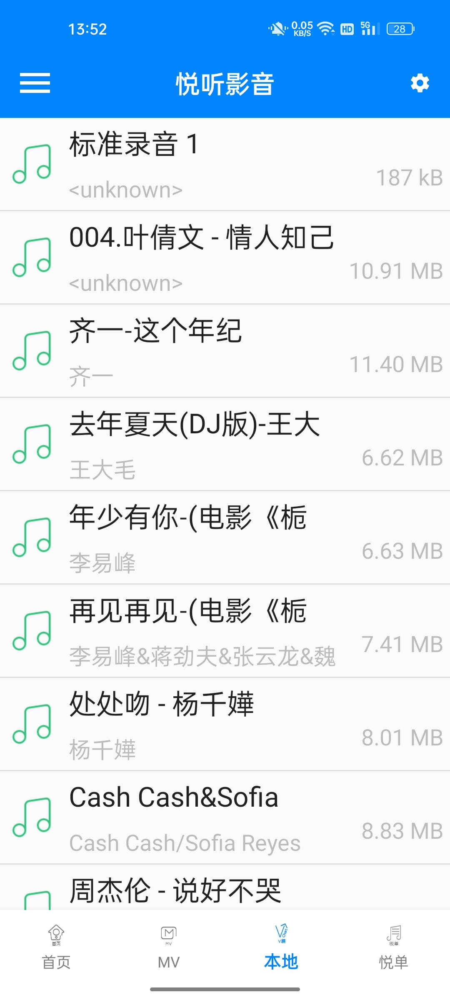
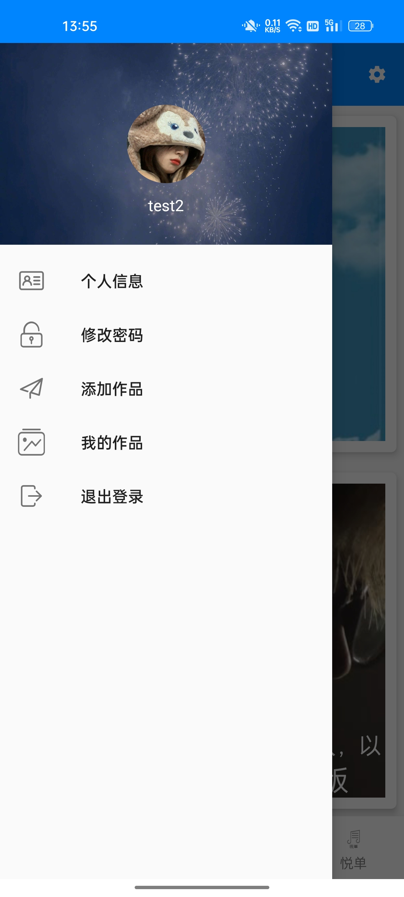
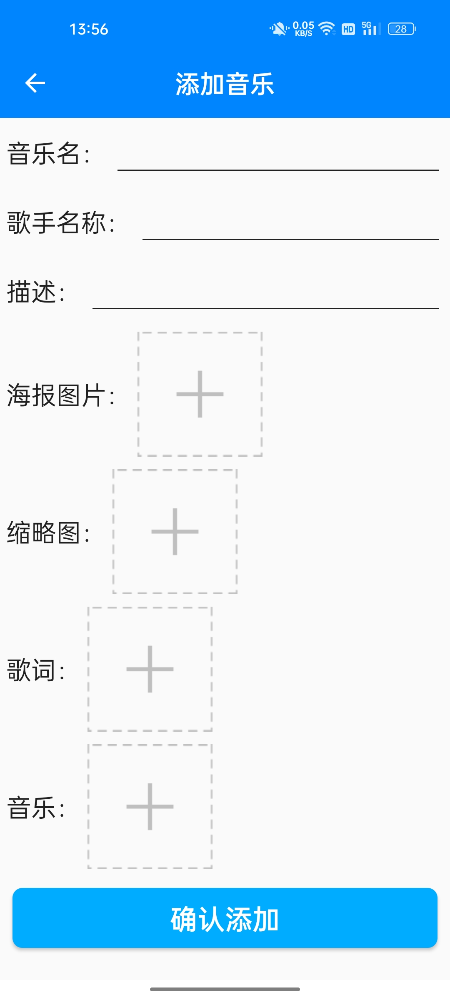
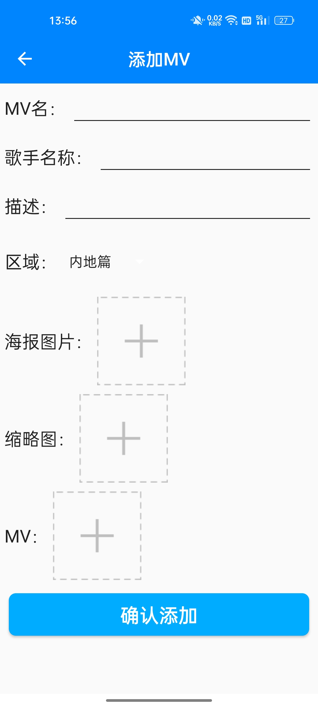
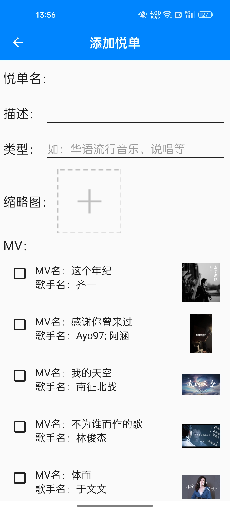
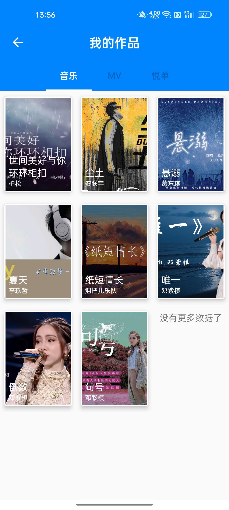
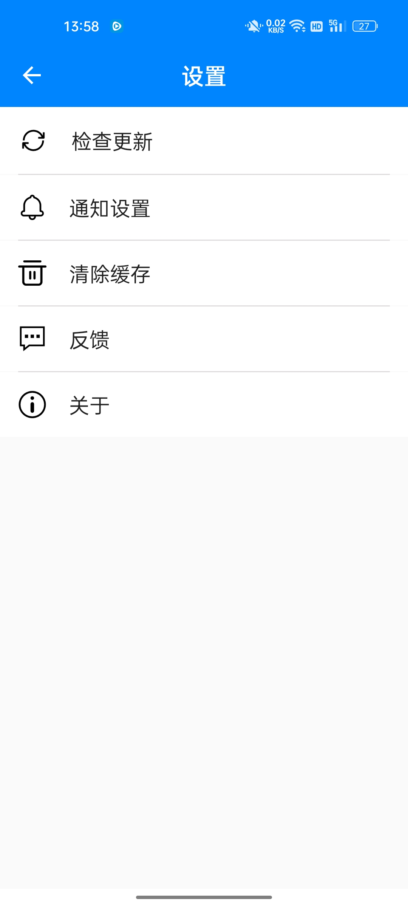

# 悦听影音（MelodiousPlayer）

## 简介
这是一款基于Android端开源的影音播放软件，具备首页、MV、本地音乐、MV清单四个页面切换、音乐和MV播放、歌词滚动、歌词列表展示、歌曲后台播放并显示通知、用户登录、注册、个人信息修改、密码修改、添加并上传音乐、MV、MV清单、查看、删除或修改我的作品、退出登录等功能，兼容Android 7至Android 16，支持深色模式。本项目基础架构和图片资源来源于黑马程序员2018最新kotlin项目实战（手机影音、即时通讯）和互联网，本软件主要作为学习和交流使用。

## 图片展示
<table>
    <tr>
        <td></td>
        <td></td>
        <td></td>
        <td></td>
    </tr>
    <tr>
        <td></td>
        <td></td>
        <td></td>
        <td></td>
    </tr>
    <tr>
        <td></td>
        <td></td>
        <td></td>
        <td></td>
    </tr>
    <tr>
        <td></td>
        <td></td>
        <td></td>
        <td></td>
    </tr>
</table>

## 运行说明
本项目有配套的服务器端后台管理系统，具体查看：
- 悦听影音后台管理系统前端界面（[github](https://github.com/LMINediva/melodious-player-admin) | [gitee](https://gitee.com/lminediva/melodious-player-admin)）
- 悦听影音后台管理系统后端（[github](https://github.com/LMINediva/MelodiousPlayerServer) | [gitee](https://gitee.com/lminediva/MelodiousPlayerServer)）

## 许可
> Copyright (C) liuhaiyang, Ganzhou Quxiang Inc. Open source codes for study only.
> Do not use for commercial purpose.
>
> Licensed under the Apache License, Version 2.0 (the "License");
> you may not use this file except in compliance with the License.
> You may obtain a copy of the License at
>
> http://www.apache.org/licenses/LICENSE-2.0
>
> Unless required by applicable law or agreed to in writing, software
> distributed under the License is distributed on an "AS IS" BASIS,
> WITHOUT WARRANTIES OR CONDITIONS OF ANY KIND, either express or implied.
> See the License for the specific language governing permissions and
> limitations under the License.